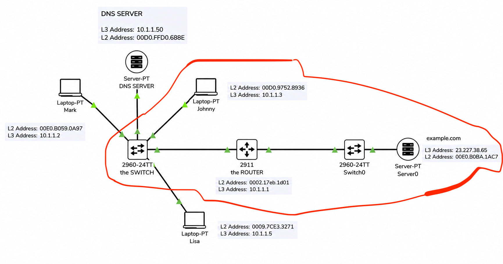

# OSI Model and TCP/IP Model

## 1. The Idea

When a device opens a website on the Internet, the data does not move randomly.

There are models that organize the communication process between devices, and the two most important models are:

OSI Model  
TCP/IP Model

These models explain how data is prepared, how it moves from one device to another, and how each device understands its part of the process.

The basic idea:

The device prepares the data from top to bottom before transmission  
And the receiving device opens the data from bottom to top upon reception

## 2. The Scenario Used

We have a device called Johnny that wants to open the website:

```text
example.com
```

The website is located on a Web Server in another network.

The general path is approximately:

```text
Johnny
→ Switch
→ Router
→ Switch
→ Web Server
```

### Network Topology (Used in This Scenario)



The goal is to follow the data as it moves across these devices and understand what happens in each Layer.

## 3. TCP/IP Model and OSI Model

In real practice, most networks use the:

**TCP/IP Model**

But in study and certifications such as CCNA, the:

**OSI Model**

is often used because OSI separates the process into 7 clear layers.

## 4. OSI Model Layers

The OSI Model contains 7 layers:

```text
Layer 7 - Application
Layer 6 - Presentation
Layer 5 - Session
Layer 4 - Transport
Layer 3 - Network
Layer 2 - Data Link
Layer 1 - Physical
```

Here, the main focus is on:

* Layer 7
* Layer 4
* Layer 3
* Layer 2
* Layer 1

As for Layer 6 and Layer 5, they are mentioned briefly, because in TCP/IP they are often integrated into the Application Layer.

## 5. The Beginning of the Connection from the Browser

Johnny opens the browser and types:

```text
https://example.com
```

Here the process begins from the top layers.

The browser is the application being used, so the first layer we deal with is:

**Layer 7 - Application Layer**

## 6. Layer 7 — Application Layer

This layer is very close to the user and the applications.

Examples of applications or protocols that work at this layer:

* HTTP
* HTTPS
* DNS
* FTP
* SMTP

In this scenario, Johnny uses the browser to access a website, so the protocol used is:

**HTTPS**

Or if it is not encrypted:

**HTTP**

The meaning:

The browser wants to send a request to the Web Server to retrieve the website page.

## 7. HTTP and HTTPS

### HTTP

HTTP = Hypertext Transfer Protocol

It is used to request web pages from the server.

Its well-known port is:

**Port 80**

### HTTPS

HTTPS = HTTP Secure

It is a secure and encrypted version of HTTP.

Its well-known port is:

**Port 443**

In this example, the request uses HTTPS, so the destination is usually:

**TCP Port 443**

## 8. Layer 6 and Layer 5 Briefly

### Layer 6 — Presentation Layer

This layer is concerned with things such as:

* Encryption
* Compression
* Data Formatting

This means how data is represented, encrypted, or compressed.

### Layer 5 — Session Layer

This layer is concerned with managing sessions between applications.

For example:

* Opening a communication session
* Keeping it active
* Closing it

In the TCP/IP Model, these functions are often integrated into the Application Layer.

## 9. Layer 4 — Transport Layer

After the application prepares the data, it moves to:

**Layer 4 - Transport Layer**

This layer is concerned with how data is transported between the two devices.

The two most important protocols here are:

* TCP
* UDP

## 10. TCP

TCP = Transmission Control Protocol

TCP is used when we want a reliable connection.

This means it cares that the data arrives correctly.

TCP characteristics:

* Reliable
* Connection-oriented
* Uses acknowledgments
* Can retransmit lost data

This means that if some data is lost, it can be retransmitted.

TCP is used in things such as:

* HTTPS
* HTTP
* SSH
* Email
* File transfer

## 11. UDP

UDP = User Datagram Protocol

UDP is faster but less reliable.

It does not care to the same degree as TCP about making sure everything arrives.

UDP characteristics:

* Faster
* Connectionless
* No guarantee of delivery
* Less overhead

UDP is often used in things that need speed more than complete accuracy, such as:

* Voice
* Video streaming
* Online gaming
* DNS usually

## 12. Ports in Layer 4

Layer 4 uses Ports to identify the intended application or service.

For example:

* HTTPS = Port 443
* HTTP = Port 80

When Johnny sends an HTTPS request, the destination is:

```text
Destination Port = 443
```

The Port helps the receiving device know which service should receive the data.

For example:

* Port 443 → Web Server HTTPS
* Port 22 → SSH
* Port 53 → DNS

## 13. Encapsulation

As the data moves down from one layer to another, each layer adds its own information.

This process is called:

**Encapsulation**

The idea is similar to putting a letter inside an envelope, then putting that envelope inside another envelope, then inside another one.

Mental example:

```text
Application Data
→ Layer 4 Header is added
→ Layer 3 Header is added
→ Layer 2 Header is added
→ It becomes signals on the cable
```

Each layer adds a Header containing information that helps the corresponding layer in the other device understand the data.

## 14. Layer 4 PDU — Segment

**Protocol Data Unit (PDU) is a specific block of information transferred between network entities within a communication network.**

When the Transport Layer adds its information to the data, the message is called:

**Segment**

This means:

```text
Data + Layer 4 Header = Segment
```

Inside the Layer 4 Header there is information such as:

* TCP or UDP
* Source Port
* Destination Port

In this scenario:

* Protocol = TCP
* Destination Port = 443

## 15. Layer 3 — Network Layer

After Layer 4, the data moves to:

**Layer 3 - Network Layer**

This layer is concerned with reaching across different networks.

The most important thing in it is:

**IP Address**

The Router operates at this layer.

## 16. Layer 3 Information

At Layer 3, an IP Header is added.

This Header contains:

* Source IP Address
* Destination IP Address

Example:

```text
Source IP = 10.1.1.3
Destination IP = 23.227.38.65
```

This means:

The message is from Johnny’s device to the Web Server.

## 17. Layer 3 PDU — Packet

After adding the Layer 3 Header, the message becomes called:

**Packet**

This means:

```text
Segment + Layer 3 Header = Packet
```

Important rule:

```text
Layer 3 = IP Address = Router = Packet
```

The Packet contains the general direction of the journey from the source to the final destination.

## 18. Layer 2 — Data Link Layer

After Layer 3, the data moves to:

**Layer 2 - Data Link Layer**

This layer is concerned with movement within the local network or to the next device directly.

The most important thing in it is:

**MAC Address**

The Switch operates at this layer.

## 19. Layer 2 Information

At Layer 2, the following is added:

* Layer 2 Header
* Layer 2 Trailer

Inside the Layer 2 Header there is information such as:

* Source MAC Address
* Destination MAC Address

In the first part of the journey:

```text
Source MAC = MAC of Johnny’s device
Destination MAC = MAC of the router
```

Why the router?

Because the server is in a different network, so Johnny sends the data first to the Default Gateway.

## 20. Layer 2 PDU — Frame

After adding the Layer 2 Header and Trailer, the message becomes called:

**Frame**

This means:

```text
Packet + Layer 2 Header + Trailer = Frame
```

Important rule:

```text
Layer 2 = MAC Address = Switch = Frame
```

The Frame gives instructions to the Switch:

Send this data to the next MAC Address.

## 21. Layer 1 — Physical Layer

After the data becomes a Frame, it moves to:

**Layer 1 - Physical Layer**

This layer represents the physical things:

* Ethernet Cable
* Electrical Signals
* Ports
* Connectors
* Bits

Here the data is transformed into electrical signals that travel through the cable.

## 22. Summary of the Encapsulation Process During Transmission

The order from top to bottom:

```text
Application Data
↓
Segment
↓
Packet
↓
Frame
↓
Bits / Electrical Signals
```

More simply:

```text
Layer 7 Data
Layer 4 Segment
Layer 3 Packet
Layer 2 Frame
Layer 1 Bits
```

## 23. Arrival of the Frame at the Switch

When the Frame reaches the Switch, the Switch does not understand all the layers.

The Switch is concerned only with:

**Layer 2**

This means it looks at:

**Destination MAC Address**

Then it searches in:

**MAC Address Table / CAM Table**

If it finds that the router’s MAC Address is on a certain port, it sends the Frame to that port.

## 24. What Does the Switch See?

The Switch does not care about:

* IP Address
* TCP
* HTTPS
* Application Data

It only sees:

* Source MAC
* Destination MAC

Therefore, we can say:

**Switch has Layer 2 eyes**

This means it sees only Layer 2 to make the forwarding decision.

## 25. Arrival of the Data at the Router

When the Frame reaches the router, the router inspects Layer 2 first.

It verifies that:

```text
Destination MAC = router’s MAC
```

If the message is for it, it opens the Frame.

This process is called:

**De-encapsulation**

This means removing the outer wrapping and reading the layer beneath it.

## 26. De-encapsulation at the Router

The router receives:

**Frame**

Then it opens Layer 2 and sees inside it:

**Packet**

The router cares about Layer 3, so it looks at:

**Destination IP Address**

Then it searches in the Routing Table to determine the correct path.

## 27. How Does the Router Decide Where to Send the Data?

The router sees that the destination is:

```text
23.227.38.65
```

Then it asks itself:

Which Interface connects me to this network?

It searches in the:

**Routing Table**

Then it decides to send the data out of the appropriate port toward the server network.

## 28. The Router Performs Encapsulation Again

Before the router sends the data to the next network, it must convert it again into a Frame.

But this time, the Layer 2 Header changes.

In the first journey:

```text
Source MAC = Johnny
Destination MAC = Router
```

After the router:

```text
Source MAC = Router
Destination MAC = Web Server
```

As for Layer 3, it usually remains the same:

```text
Source IP = Johnny
Destination IP = Web Server
```

The important idea:

**IP Addresses remain from the source to the final destination**  
**MAC Addresses change at every Hop**

## 29. Arrival of the Frame at the Second Switch

After the router sends a new Frame, it reaches another Switch located in the server’s network.

The second Switch does the same thing:

* It looks at the Destination MAC
* It checks the MAC Address Table
* It sends the Frame to the server port

Again, the Switch does not care about IP, TCP, or HTTPS.

It only deals with Layer 2.

## 30. Arrival of the Data at the Web Server

When the Frame reaches the Web Server, the server begins the complete De-encapsulation process.

It opens the layers one by one:

* Layer 2: Is the MAC Address mine?
* Layer 3: Is the IP Address mine?
* Layer 4: Is Port 443 mine?
* Layer 7: Is this an HTTPS web request?

If all the information is correct, the request is passed to the web service.

## 31. How Does the Server Understand the Request?

The server sees that the request is directed to:

**TCP Port 443**

So it knows that the request belongs to:

**HTTPS Service**

Then at the Application Layer it understands that the browser is requesting the website page.

For example:

```text
GET /
```

This means:

Send me the home page.

## 32. The Reply from the Server

After the Web Server understands the request, it prepares the reply.

Then the process starts again, but in reverse:

```text
Web Server
→ Switch
→ Router
→ Switch
→ Johnny
```

The server performs Encapsulation for the reply:

```text
Application Data
→ Segment
→ Packet
→ Frame
→ Bits
```

And when the reply reaches Johnny, Johnny’s device opens the layers until the data reaches the browser.

## 33. The Overall Picture of the Entire Process

The whole process can be summarized like this:

Johnny types the website in the browser  
↓  
Application Layer prepares an HTTPS request  
↓  
Transport Layer adds TCP and Port 443  
↓  
Network Layer adds Source IP and Destination IP  
↓  
Data Link Layer adds Source MAC and Destination MAC  
↓  
Physical Layer sends Bits over the cable  
↓  
Switch reads MAC and sends to the router  
↓  
Router reads IP and chooses the path  
↓  
Another Switch reads MAC and sends to the server  
↓  
Server opens the layers and understands the request  
↓  
Server sends the reply back using the same method in reverse

## 34. Data Names by Layer

It is important to memorize the data names in each layer:

```text
Layer 7 Data
Layer 4 Segment
Layer 3 Packet
Layer 2 Frame
Layer 1 Bits
```

Or practically:

```text
Data → Segment → Packet → Frame → Bits
```

And upon reception:

```text
Bits → Frame → Packet → Segment → Data
```

## 35. The Function of Each Device in the Path

### Johnny’s device

Creates the request and performs Encapsulation.

### Switch

Inspects the MAC Address and sends the Frame to the correct port.

It operates at:

**Layer 2**

### Router

Inspects the IP Address and chooses the next network.

It operates at:

**Layer 3**

### Web Server

Opens all the layers and understands the application request.

## 36. Important Comparison Between Switch and Router

### Switch:

* Operates at Layer 2
* Uses MAC Address
* Deals with Frames
* Connects devices inside the same network

### Router:

* Operates at Layer 3
* Uses IP Address
* Deals with Packets
* Connects different networks

## 37. Why Do We Need These Models?

Without OSI and TCP/IP, it would be difficult to organize how devices communicate.

These models make each layer responsible for a certain part.

For example:

* Application Layer is concerned with the application
* Transport Layer is concerned with the transport method
* Network Layer is concerned with IP and routing
* Data Link Layer is concerned with MAC and the switch
* Physical Layer is concerned with the cable and the signal

This separation makes networks understandable, analyzable, and diagnosable.

## What Are the Functions of the Application Layer?

The Application Layer is concerned with the applications and protocols used by the user or the programs.

Examples of its functions:

* Providing network services to applications
* Managing communication between applications
* Directing data to the correct program

But things such as MAC Address, IP Address, or guaranteeing delivery are not functions of the Application Layer.

## The Difference Between TCP and UDP

### TCP:

* Reliable
* Connection-oriented
* Uses Three-Way Handshake
* Slower than UDP relatively

### UDP:

* Connectionless
* Faster
* No guaranteed delivery
* No Three-Way Handshake

## ARP, DNS, and RARP

### ARP

```text
IP → MAC
```

It is used to find the MAC Address associated with an IP address within the same network.

### DNS

```text
Name → IP
```

It is used to convert a name such as:

```text
google.com
```

into an IP Address.

### RARP

**RARP it stands for reverse arp and it's arp and reverse you got the mac address but you want to find the ip address**

```text
MAC → IP
```

It is Reverse ARP, which means the opposite of ARP.

## The Most Important Memorization Rules

```text
Layer 1 = Bits / Cables / Electrical Signals
Layer 2 = Frames / MAC / Switch
Layer 3 = Packets / IP / Router
Layer 4 = Segments / TCP or UDP / Ports
Layer 7 = Application Protocols such as HTTP and HTTPS and DNS
```

A very short rule:

```text
Application = What does the user want?
Transport = How do we transport the data?
Network = To which IP do we send?
Data Link = To which MAC do we send now?
Physical = How is the data transformed into signals?
```
